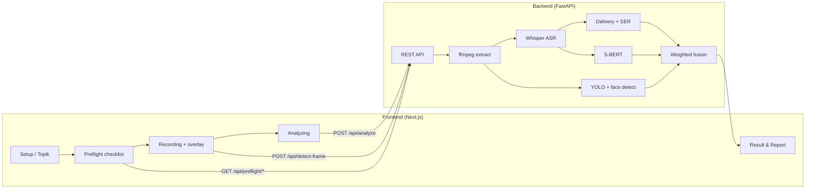

# Lumen — AI Interview Simulator

Platform simulasi wawancara berbasis AI yang menilai performa kandidat secara **multimodal** (video, audio, dan teks). Sistem menghasilkan skor final **0–100** beserta umpan balik yang dapat ditindaklanjuti untuk persiapan wawancara kerja.

> Capstone project — Data Science / Full-Stack

---

## Fitur utama

| Area | Kemampuan |
|------|-----------|
| **Rekaman** | Webcam + mikrofon langsung di browser, dengan overlay emosi wajah real-time |
| **Transkripsi** | Whisper (Indonesia–Inggris) dengan pengaturan anti-halusinasi |
| **Konten** | Skor komposit: relevansi Q↔A (E5 + cross-encoder), rubric, kelengkapan/STAR |
| **Delivery** | WPM, filler words, analisis jeda, emosi suara (Wav2Vec2 SER) |
| **Non-verbal** | Deteksi wajah + klasifikasi emosi (YOLOv8 + OpenCV) |
| **Skor gabungan** | Weighted fusion **40% konten · 30% delivery · 30% non-verbal** |
| **Dashboard** | Riwayat sesi, report card, dan statistik agregat |

---

## Arsitektur



---

## Tech stack

| Lapisan | Teknologi |
|---------|-----------|
| Frontend | Next.js 16, React 19, Tailwind CSS 4, TypeScript |
| Backend | FastAPI, Uvicorn, Python 3.13+ |
| ML / Audio | Whisper, Wav2Vec2, librosa, sentence-transformers |
| ML / Video | Ultralytics YOLOv8, OpenCV Haar cascade |
| Media | ffmpeg (ekstraksi audio dari video) |
| Package manager | `uv` (backend), `npm` (frontend) |

---

## Prasyarat

Pasang di mesin lokal sebelum menjalankan proyek:

1. **Node.js** 20+ dan **npm**
2. **Python** 3.13+ (sesuai `backend/pyproject.toml`)
3. **[uv](https://docs.astral.sh/uv/)** — manajer dependensi Python
4. **[ffmpeg](https://ffmpeg.org/download.html)** — harus ada di `PATH` (untuk konversi video → WAV)

Verifikasi:

```bash
node -v
npm -v
python --version
uv --version
ffmpeg -version
```

### File model wajib

Pastikan bobot YOLO untuk emosi wajah ada di:

```
backend/ml_pipeline/video/models/best.pt
```

Model Hugging Face (Whisper, Wav2Vec2, S-BERT) akan diunduh otomatis ke `backend/.hf_cache/` pada **run pertama** (bisa memakan waktu beberapa menit).

---

## Cara menjalankan proyek

Jalankan **backend** dan **frontend** di dua terminal terpisah.

### 1. Backend (API + ML)

```bash
cd backend

# Buat virtualenv & install dependensi (sekali saja)
uv sync

# Opsional: salin contoh env sebelum menjalankan lokal
cp .env.example .env

# Jalankan server API
uv run uvicorn main:app --reload --port 8000
```

Backend siap jika `GET http://localhost:8000/health` mengembalikan:

```json
{ "status": "ok" }
```

Dokumentasi interaktif API: [http://localhost:8000/docs](http://localhost:8000/docs)

### 2. Frontend (UI)

```bash
cd frontend

# Opsional: salin contoh env sebelum menjalankan lokal
cp .env.example .env.local

# Install dependensi dari lockfile
npm ci

# Development server
npm run dev
```

Buka aplikasi di [http://localhost:3000](http://localhost:3000).

### 3. (Opsional) Ubah URL backend

Default frontend memanggil `http://127.0.0.1:8000`. Untuk override, buat file `frontend/.env.local`:

```env
NEXT_PUBLIC_API_BASE_URL=http://localhost:8000
```

---

## Alur penggunaan

1. **Dashboard** → mulai simulasi baru  
2. **Setup** → pilih kategori / topik pertanyaan  
3. **Preflight** → checklist pemuatan model (Whisper, Wav2Vec2, S-BERT, YOLO, face detector)  
4. **Recording** → jawab pertanyaan; overlay emosi wajah tampil saat merekam  
5. **Analyzing** → upload & analisis multimodal di backend  
6. **Result** → ringkasan skor  
7. **Report cards** → breakdown detail (konten, delivery, non-verbal, transkrip)

---

## API endpoints

| Method | Path | Deskripsi |
|--------|------|-----------|
| `GET` | `/health` | Health check |
| `GET` | `/api/preflight/{model_key}` | Muat satu model (`whisper`, `wav2vec2`, `sbert`, `yolo`, `mediapipe`) |
| `POST` | `/api/detect-frame` | Deteksi emosi + bounding box dari satu frame JPEG |
| `POST` | `/api/analyze` | Analisis penuh rekaman (`file`, `question_text`, opsional `question_topic`) |

Contoh analisis dengan `curl`:

```bash
curl -X POST "http://localhost:8000/api/analyze" \
  -F "file=@recording.webm" \
  -F "question_text=Tell me about a time you handled conflicting stakeholder requirements." \
  -F "question_topic=product manager behavioral interview"
```

---

## Skoring

| Komponen | Bobot | Sumber |
|----------|-------|--------|
| Content quality | 40% | S-BERT similarity vs topik pertanyaan |
| Delivery & fluency | 30% | WPM, filler rate, pauses + blend emosi suara (25%) |
| Non-verbal | 30% | Distribusi emosi wajah, stabilitas, nervous rate |

Respons API mencakup antara lain: `final_score`, `transcription`, `delivery_metrics`, `emotion_metrics`, `video_emotion_metrics`, `feedback`.

---

## Struktur proyek

```
capstone-app/
├── frontend/                 # Next.js app
│   └── app/
│       ├── dashboard/
│       ├── history/
│       ├── report-cards/
│       └── simulation/       # setup → preflight → recording → analyzing → result
├── backend/
│   ├── api/routes.py         # FastAPI routes
│   ├── core/config.py        # Model IDs, bobot, cache HF
│   ├── main.py               # Entry point
│   └── ml_pipeline/
│       ├── audio/            # Delivery, SER, filler.txt
│       ├── text/             # Whisper, S-BERT
│       ├── video/            # YOLO emotion, face detection
│       └── fusion/           # Weighted score
├── PROJECT-DESC.md           # Spesifikasi capstone
└── README.md                 # Dokumen ini
```

---

## Cache model (hindari download ulang)

Semua model Hugging Face disimpan di:

```
backend/.hf_cache/
```

Folder ini di-ignore oleh Git. Setelah unduhan pertama, restart backend akan memuat dari disk lokal tanpa mengunduh ulang (selama cache tidak dihapus).

File media lokal untuk pengujian manual, seperti rekaman `.mp4`, `.webm`, atau `.wav` di `test-case/`, juga tidak disimpan di Git. Tambahkan file uji sendiri secara lokal bila perlu menjalankan analisis manual.

---

## Troubleshooting

| Masalah | Solusi |
|---------|--------|
| `ffmpeg is not installed` | Pasang ffmpeg dan pastikan ada di `PATH` |
| Analisis gagal / network error | Pastikan backend jalan di port **8000** sebelum merekam |
| Preflight model gagal | Cek koneksi internet (unduhan pertama), ruang disk, dan `best.pt` |
| Transkripsi berulang `"to, to, to..."` | Sudah dimitigasi via `no_repeat_ngram_size`, `repetition_penalty`, `condition_on_previous_text=False` |
| Rekaman terlalu besar | Video disimpan di **IndexedDB** browser (bukan sessionStorage) |
| Hydration error di halaman result | Refresh halaman; pastikan analisis selesai sebelum membuka `/simulation/result` |
| CORS error | Backend mengizinkan origin `http://localhost:3000` — jalankan frontend di port tersebut |

---

## Development

```bash
# Backend — lint/test ringan
cd backend
uvx ruff check .
uvx pytest

# Frontend — lint dan production build
cd frontend
npm run lint
npm run build && npm start
```

---

## Tim & lisensi

Proyek capstone — sesuaikan bagian kredit dan lisensi sesuai kebijakan kampus Anda.

Untuk detail spesifikasi arsitektur awal, lihat [`PROJECT-DESC.md`](./PROJECT-DESC.md).
