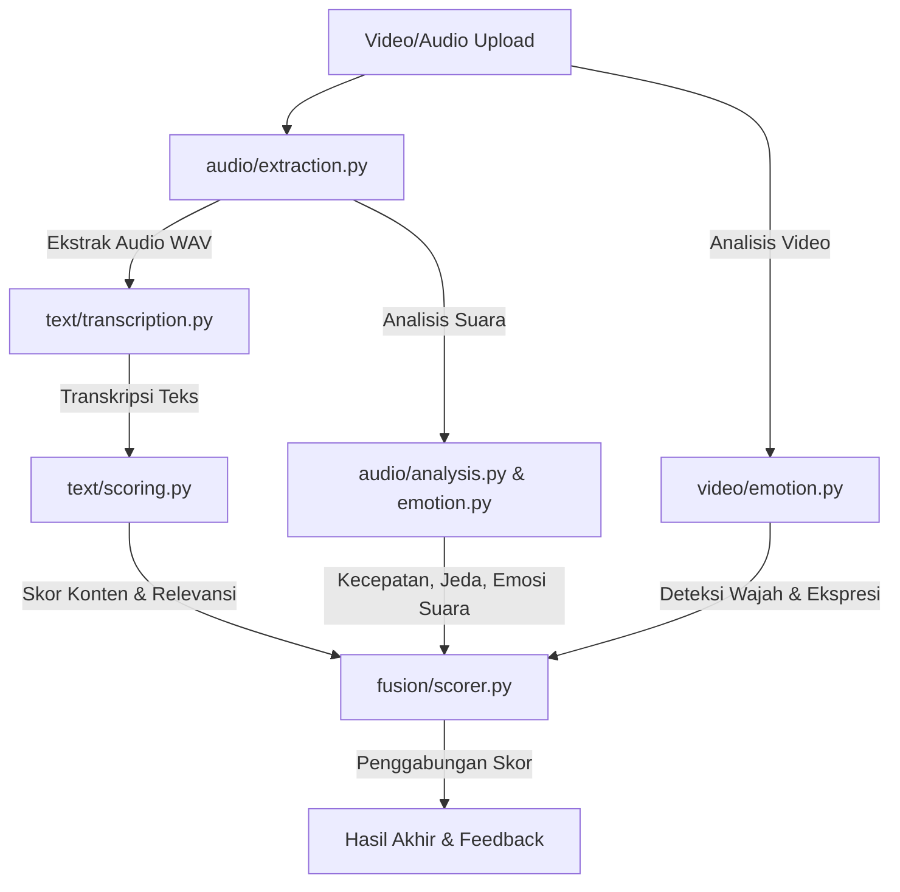

# ML Pipeline - Analisis Wawancara (Interview Analysis)

Folder ini berisi seluruh kode untuk pemrosesan Machine Learning (ML) yang menganalisis rekaman wawancara (audio & video) dan teks jawaban kandidat.

## Alur Utama (How It Works)

Secara sederhana, ketika sebuah video wawancara diunggah, sistem akan memprosesnya melalui langkah-langkah berikut:

---

## Penjelasan Singkat Tiap Berkas (Modules Breakdown)

### 1. 🎙️ Bagian Audio (`audio/`)
* **`extraction.py`**: Mengekstrak suara dari video unggahan dan mengubahnya menjadi format standar WAV mono 16 kHz menggunakan alat `ffmpeg`.
* **`analysis.py`**: Mengukur kualitas penyampaian kandidat secara verbal, seperti:
  * **WPM (Words Per Minute)**: Kecepatan berbicara.
  * **Filler Words**: Menghitung kata pengisi seperti *"um"*, *"uh"*, *"jadi"*, *"ya"*, dll.
  * **Pauses**: Menghitung seberapa sering dan seberapa lama kandidat terdiam/jeda saat menjawab.
  * **Delivery Score**: Memberikan nilai kelancaran (0–100) berdasarkan parameter di atas.
* **`emotion.py`**: Menggunakan AI (model Wav2Vec2) untuk menebak emosi dari suara kandidat (misal: apakah terdengar gugup, tenang, sedih, atau marah).

### 2. 📝 Bagian Teks (`text/`)
* **`transcription.py`**: Mengubah rekaman suara menjadi teks tertulis menggunakan model **Whisper** (teknologi speech-to-text yang akurat).
* **`content_helpers.py`**: Membantu menganalisis struktur jawaban, misalnya apakah jawaban menggunakan metode **STAR** (Situation, Task, Action, Result) untuk pertanyaan berbasis perilaku (behavioral).
* **`scoring.py`**: Menggunakan AI (SentenceTransformers E5 & Cross-Encoder) untuk membandingkan seberapa cocok jawaban kandidat dengan pertanyaan wawancara yang diajukan (skor relevansi konten).

### 3. 📷 Bagian Video (`video/`)
* **`emotion.py`**: Menganalisis ekspresi wajah kandidat dari video:
  * Memotong video menjadi beberapa gambar per detik (frame sampling).
  * Mendeteksi letak wajah menggunakan model **YOLOv8-face**.
  * Menebak emosi wajah (senang, netral, tegang, dll.) menggunakan model klasifikasi **YOLOv8**.

### 4. 🎛️ Penggabungan Skor (`fusion/`)
* **`scorer.py`**: Menggabungkan seluruh hasil penilaian (Konten teks 40%, Suara 30%, Ekspresi wajah 30%) menjadi satu nilai akhir (0–100) serta menyusun saran atau masukan (feedback) otomatis yang bermanfaat bagi kandidat.
